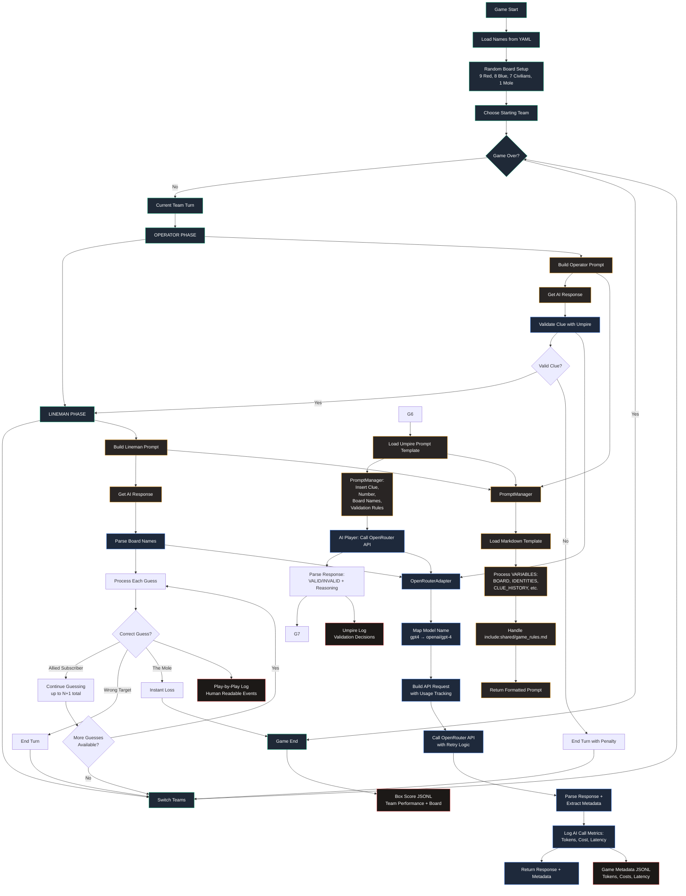

# The Switchboard AI Game Simulator

A Python simulation of **The Switchboard**, a game of clandestine communication and deduction where Operators pass cryptic messages to their Linemen to help them identify Allied Subscribers while avoiding The Mole.

## Game Overview

In The Switchboard:
- **25 names** are arranged on a board with hidden identities
- **Red Team**: 9 Allied Subscribers
- **Blue Team**: 8 Allied Subscribers  
- **7 Innocent Civilians**
- **1 The Mole** (instant loss if contacted)

Teams alternate turns:
1. **Operator** gives a cryptic clue and number
2. **Linemen** make up to N+1 guesses based on the clue
3. First team to find all their Allied Subscribers wins
4. Contact The Mole = instant loss

## Features

- **AI vs AI**: Different models for each team
- **Human vs AI**: Interactive mode for human players
- **Flexible AI Configuration**: Separate model assignment per team
- **External Prompt Templates**: Markdown files for easy prompt tuning
- **Expert Clue Types**: Support for zero clues (0) and unlimited clues
- **Umpire Validation**: AI-powered clue validation for fair play
- **Prompt Testing**: Built-in tools to test and debug AI prompts
- **Comprehensive Logging**: Detailed game logs and statistics
- **OpenRouter Integration**: Access to 200+ AI models

## Installation

Requires Python ≥3.12 and [uv](https://github.com/astral-sh/uv).

```bash
git clone <repository>
cd switchboards
uv sync
```

## Quick Start

### Set Up API Key
```bash
export OPENROUTER_API_KEY="your-key-here"
```

### Run AI vs AI Game
```bash
uv run switchboard run --red gpt4 --blue claude
```

### Interactive Mode (Human vs AI)
```bash
uv run switchboard run --red gpt4 --interactive
```

### Multiple Games
```bash
uv run switchboard run --red gpt4 --blue claude --num-puzzles 5
```

### Test AI Prompts
```bash
# Test operator prompts
uv run switchboard prompt operator --seed 42 --team red

# Test lineman prompts with regular clues
uv run switchboard prompt lineman --seed 42 --clue "TOOLS" --number 3

# Test expert clue types
uv run switchboard prompt lineman --clue "ANIMALS" --number 0
uv run switchboard prompt lineman --clue "FRUITS" --number unlimited

# Test umpire validation
uv run switchboard prompt umpire --seed 42 --clue "MILITARY" --number 2
```

## Command Line Options

```bash
uv run switchboard run [OPTIONS]
```

| Option | Description |
|--------|-------------|
| `--red MODEL` | AI model for Red Team |
| `--blue MODEL` | AI model for Blue Team |
| `--interactive` | Enable human player mode |
| `--num-puzzles N` | Number of games to play (default: 1) |
| `--seed N` | Random seed for reproducible games |
| `--names-file PATH` | Path to names YAML file |
| `--red-operator-prompt PATH` | Red operator prompt file |
| `--red-lineman-prompt PATH` | Red lineman prompt file |
| `--blue-operator-prompt PATH` | Blue operator prompt file |
| `--blue-lineman-prompt PATH` | Blue lineman prompt file |
| `--umpire MODEL` | AI model for umpire validation |
| `--no-umpire` | Disable umpire validation |
| `--log-path PATH` | Directory for log files |
| `--verbose` | Enable verbose logging |

### Prompt Testing Commands

```bash
uv run switchboard prompt [operator|lineman|umpire] [OPTIONS]
```

| Option | Description |
|--------|-------------|
| `--team red/blue` | Team color (red or blue) |
| `--seed N` | Random seed for reproducible boards |
| `--clue TEXT` | Sample clue for lineman/umpire testing |
| `--number N` | Sample number (supports 0, unlimited, or integers) |

## Available Models

The simulator supports 45+ models through OpenRouter. Use the `list-models` command to see all available options:

```bash
uv run switchboard list-models
```

**Popular models include:**
- `gpt4`, `gpt5`, `o3`, `o1` - OpenAI models
- `claude`, `sonnet`, `opus-4.1` - Anthropic models  
- `gemini`, `gemini-flash` - Google models
- `grok3`, `grok4` - xAI models
- `llama-3.3`, `qwen3`, `deepseek` - Open source models

**Reasoning models** (o1, o3, grok4, etc.) are automatically detected and configured with appropriate parameters.

## Architecture

The Switchboard simulator uses a modular design with three key submodules that handle different aspects of AI-driven gameplay:

**Key Submodules:**
- **Prompt Manager**: Builds formatted prompts from markdown templates with variable substitution
- **OpenRouter Adapter**: Handles AI API calls with cost tracking and retry logic  
- **Umpire**: Validates operator clues for fairness (operator phase only)

**Flow:** Build Prompt → Get AI Response → (Umpire Validation for Operators) → Process Results



## Project Structure

```
switchboard/
├── cli.py              # Command-line interface
├── game.py             # Core game logic
├── player.py           # Player classes (AI & Human)
├── prompt_manager.py   # Prompt template management
├── adapters/
│   └── openrouter_adapter.py  # OpenRouter API integration
└── utils/
    └── logging.py      # Logging utilities

inputs/
└── names.yaml          # Name bank for games

prompts/
├── red_operator.md     # Red team operator prompts
├── red_lineman.md      # Red team lineman prompts
├── blue_operator.md    # Blue team operator prompts
├── blue_lineman.md     # Blue team lineman prompts
├── umpire.md           # Umpire clue validation prompts
└── shared/
    └── game_rules.md   # Shared game rules for all prompts

logs/                   # Game logs and performance analytics
```

## Advanced Game Features

### Expert Clue Types

The Switchboard supports advanced clue strategies:

- **Zero Clues (0)**: "None of our words relate to this clue" - unlimited guesses, must guess at least one
- **Unlimited Clues**: Multiple related words from previous rounds - unlimited guesses, no minimum

```bash
# Examples in interactive mode
Red Operator: "ANIMALS" (0)    # Zero clue
Blue Operator: "FRUITS" (unlimited)  # Unlimited clue
```

### Umpire Validation

AI-powered clue validation ensures fair play by checking:
- Single word requirement (with exceptions for compound words, proper names, abbreviations)
- No direct board name matches
- No variants of board words
- No letter count references
- No position references

### Game History Tracking

Linemen receive comprehensive game history showing all previous clues and outcomes:

```
Turn 1a: Red Clue: "FRUITS" (3)
  → APPLE ✓, BANANA ✓, COCONUT ○ (civilian)

Turn 1b: Blue Clue: "METALS" (2)
  → IRON ✓, STEEL ✗ (enemy)
```

## Customization

### Prompt Templates

Modify the Markdown files in `prompts/` to customize AI behavior. Templates support variable substitution:

**Operator Prompts:**
- `{{RED_SUBSCRIBERS}}` - Your allied subscribers
- `{{BLUE_SUBSCRIBERS}}` - Enemy subscribers  
- `{{CIVILIANS}}` - Innocent civilians
- `{{MOLE}}` - The dangerous mole

**Lineman Prompts:**
- `{{BOARD}}` - Current 5x5 board grid
- `{{AVAILABLE_NAMES}}` - Available names to guess
- `{{CLUE_HISTORY}}` - Formatted game history
- `{{CLUE}}` - Current clue
- `{{NUMBER}}` - Current number (supports 0, unlimited)

**Shared Rules:**
Use `{{include:shared/game_rules.md}}` to include common game rules across prompts.

### Model Configuration

Add new models by editing `inputs/model_mappings.yml`:

```yaml
models:
  # Add custom model mappings
  my-model: "provider/model-id"
  custom-gpt: "openai/gpt-4-custom"
  # ... etc
```

### Name Banks

Edit `inputs/names.yaml` to customize the name pool:

```yaml
names:
  - ALPHA
  - BRAVO
  - CHARLIE
  # ... add more names
```

## Example Game

```bash
$ uv run switchboard run --red gpt4 --blue claude --verbose

🎯 The Switchboard Game Starting!

Turn 1 - Red Team
┏━━━━━━━━━━━━━┳━━━━━━━━━━━━━┳━━━━━━━━━━━━━┳━━━━━━━━━━━━━┳━━━━━━━━━━━━━┓
┃    ALPHA    ┃    BRAVO    ┃   CHARLIE   ┃    DELTA    ┃     ECHO    ┃
┃   FOXTROT   ┃     GOLF    ┃    HOTEL    ┃    INDIA    ┃   JULIET    ┃
┃     KILO    ┃     LIMA    ┃     MIKE    ┃  NOVEMBER   ┃    OSCAR    ┃
┃     PAPA    ┃    QUEBEC   ┃    ROMEO    ┃   SIERRA    ┃    TANGO    ┃
┃   UNIFORM   ┃    VICTOR   ┃   WHISKEY   ┃     XRAY    ┃   YANKEE    ┃
┗━━━━━━━━━━━━━┻━━━━━━━━━━━━━┻━━━━━━━━━━━━━┻━━━━━━━━━━━━━┻━━━━━━━━━━━━━┛

Red Team Remaining: 9  Blue Team Remaining: 8

Red Operator: "Military phonetic alphabet" (3)
Red Lineman guesses: ALPHA
✓ Correct! ALPHA is an Allied Subscriber
Red Lineman guesses: BRAVO
✓ Correct! BRAVO is an Allied Subscriber
Red Lineman guesses: CHARLIE
✗ CHARLIE is an Innocent Civilian

Turn 2 - Blue Team
...
```

## Logging & Analytics

The simulator creates comprehensive logs for analysis and debugging:

### Log Types

1. **Play-by-Play Logs** (`logs/play_by_play_*.log`)
   - Human-readable game events and board states
   - Perfect for understanding game progression
   - Shows clues, guesses, results, and team performance

2. **Box Score Analytics** (`logs/box_scores_*.jsonl`)
   - Team performance summaries in structured format
   - Includes accuracy metrics, move counts, win/loss data
   - Features formatted 5x5 boards showing all revealed names
   - Ideal for comparing model performance across games

3. **AI Call Metadata** (`logs/game_metadata_*.jsonl`)
   - Detailed metrics for every AI interaction
   - Tracks tokens used, API costs, response latency
   - Turn-by-turn success/failure analysis
   - Essential for cost optimization and model comparison

4. **Umpire Validation Logs** (`logs/umpire_*.log`)
   - Consolidated clue validation decisions
   - Shows reasoning for accepting/rejecting clues
   - Helps debug prompt quality and game fairness

5. **Debug Logs** (`logs/switchboard_*.log`)
   - Technical debug information
   - Full API request/response details when using `--verbose`

### Performance Tracking

The JSONL logs enable powerful analysis:

```bash
# Analyze model costs across games
cat logs/game_metadata_*.jsonl | jq '.cost_usd' | awk '{sum+=$1} END {print "Total cost: $" sum}'

# Compare model accuracy by team
cat logs/box_scores_*.jsonl | jq '{team: .team, accuracy: .accuracy, model: .model}'

# Track token usage patterns
cat logs/game_metadata_*.jsonl | jq '{model: .model, tokens: .tokens_used, role: .role}'
```

## Security Features

- **Context Separation**: Each AI call is stateless and independent
- **No Conversation History**: Prevents information leakage between calls
- **Role-based Access**: Operators see all identities, Linemen see only public board

## Development

### Running Tests
```bash
uv run pytest
```

### Code Formatting
```bash
uv run black .
uv run isort .
```

### Type Checking
```bash
uv run mypy switchboard/
```

### Debugging AI Prompts

Use the built-in prompt testing tools to debug and optimize AI behavior:

```bash
# Test with different seeds to see various board configurations
uv run switchboard prompt operator --seed 42
uv run switchboard prompt operator --seed 100

# Test different clue scenarios
uv run switchboard prompt lineman --clue "WEAPONS" --number 2
uv run switchboard prompt lineman --clue "NATURE" --number unlimited
uv run switchboard prompt lineman --clue "FOOD" --number 0

# Test umpire validation with edge cases
uv run switchboard prompt umpire --clue "DELTA" --number 1  # Should be invalid (board name)
uv run switchboard prompt umpire --clue "MILITARY" --number 3  # Should be valid
```

## Contributing

1. Fork the repository
2. Create a feature branch
3. Add tests for new functionality
4. Ensure all tests pass
5. Submit a pull request

## License

MIT License - see LICENSE file for details.
